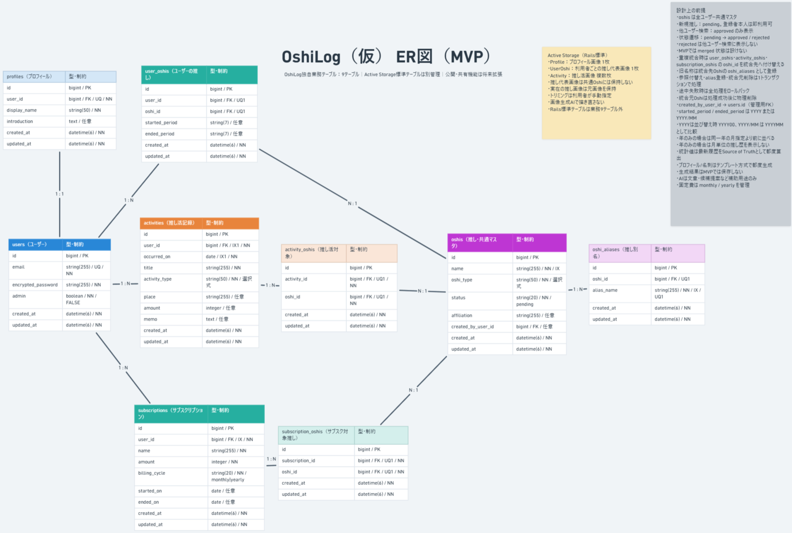
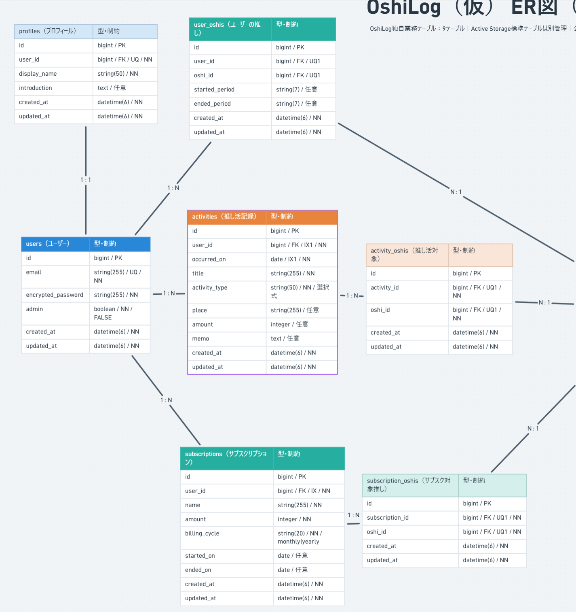
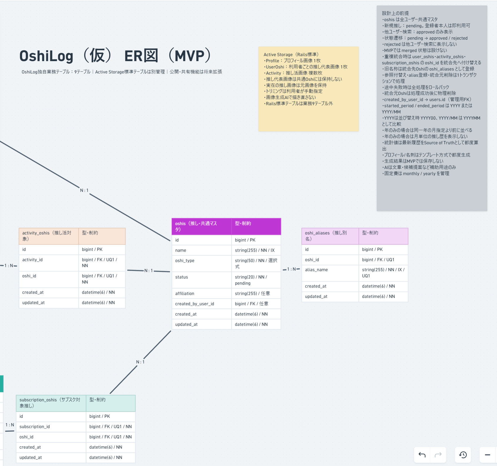
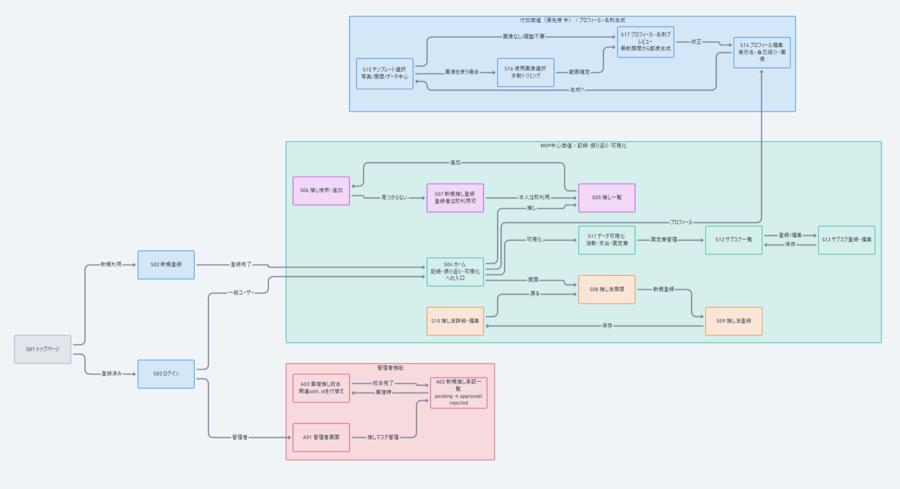
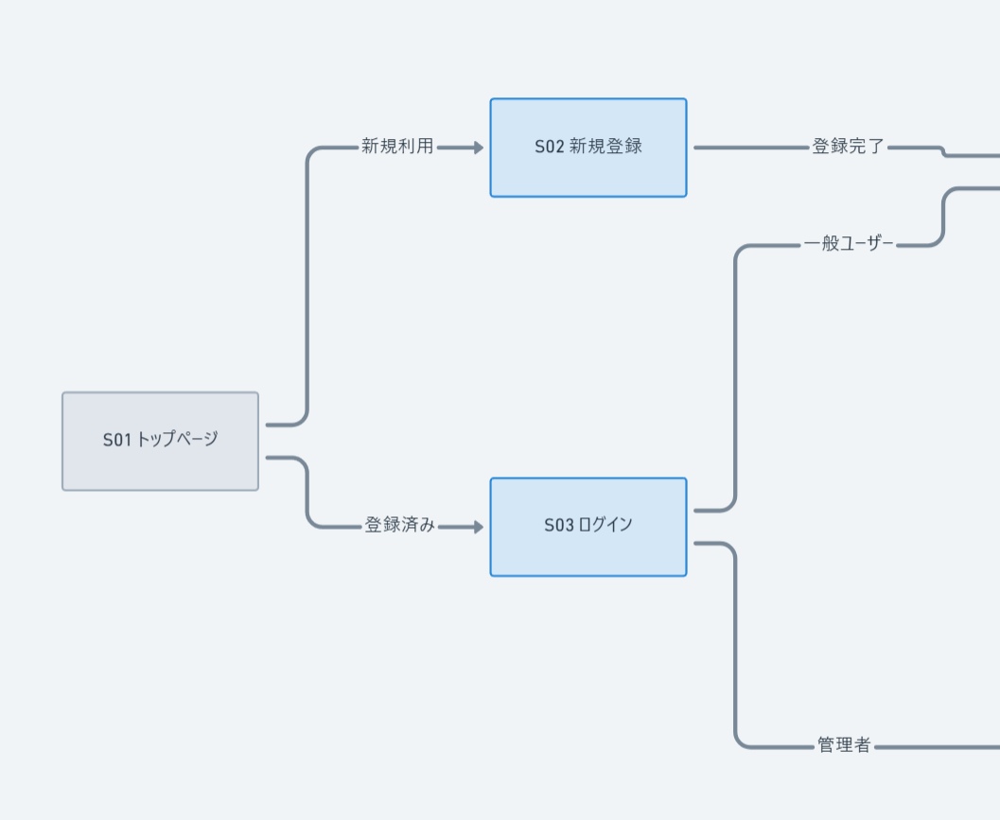
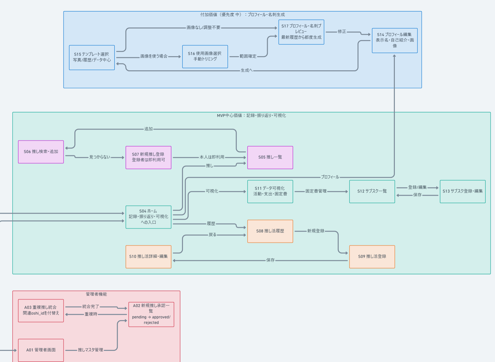

# OshiLog（仮）

## アプリケーション概要

OshiLog（仮）は、推し活を「記録する・振り返る・可視化する」ためのWebアプリケーションです。

推し活の履歴を蓄積し、活動回数・支出・推し歴・活動傾向などを可視化することで、自分がどのような推し活をしてきたかを振り返れるサービスを目指します。

MVPの中心は「記録・振り返り・可視化」とし、プロフィール・名刺生成は付加価値として位置づけます。

外部公開、URL・QRコードによる共有、ユーザー同士の交流機能については将来機能として検討します。

## 開発環境

- Ruby 4.0.6
- Ruby on Rails 8.1.4
- PostgreSQL 18.6

## 実行手順

リポジトリをクローンします。

```bash
git clone git@github.com:c8bji5ma-lgtm/my_first_app.git
```

アプリケーションのディレクトリへ移動します。

```bash
cd my_first_app
```

必要なGemをインストールします。

```bash
bundle install
```

データベースを作成します。

```bash
bin/rails db:create
```

マイグレーションを実行します。

```bash
bin/rails db:migrate
```

Railsサーバーを起動します。

```bash
bin/rails server
```

ブラウザで以下へアクセスします。

http://localhost:3000

## 要件定義資料

### チェックシート

[チェックシートを確認する](https://docs.google.com/spreadsheets/d/1hWaamzG78rVdf1tu79aZMsmti1YSxQMKiD_1AjhuCVg/edit#gid=1321893864)

### カタログ設計

[カタログ設計を確認する](https://docs.google.com/spreadsheets/d/1hWaamzG78rVdf1tu79aZMsmti1YSxQMKiD_1AjhuCVg/edit#gid=697294974)

### テーブル定義書

[テーブル定義書を確認する](https://docs.google.com/spreadsheets/d/1hWaamzG78rVdf1tu79aZMsmti1YSxQMKiD_1AjhuCVg/edit#gid=1645989784)

### ワイヤーフレーム

[Whimsicalでワイヤーフレームを確認する](https://whimsical.com/4JZqsPQdZ6TfN7LoLxQJbw)

## ER図

文字が確認しやすいよう、ER図を3枚に分けて掲載しています。







[WhimsicalでER図を確認する](https://whimsical.com/yuki-atarashi/oshilog-er-mvp-PDbRKWDyLu1fJfbJxNVMP6)

## 画面遷移図

文字が確認しやすいよう、画面遷移図を3枚に分けて掲載しています。







[Whimsicalで画面遷移図を確認する](https://whimsical.com/WDUvK4vCEAQMWQW7cbuDjR)